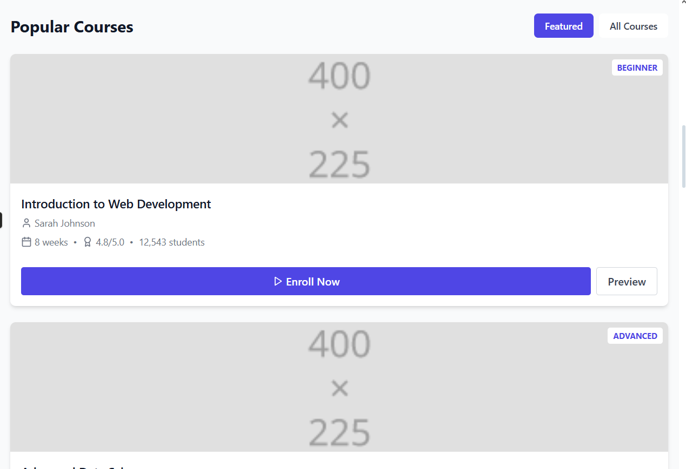
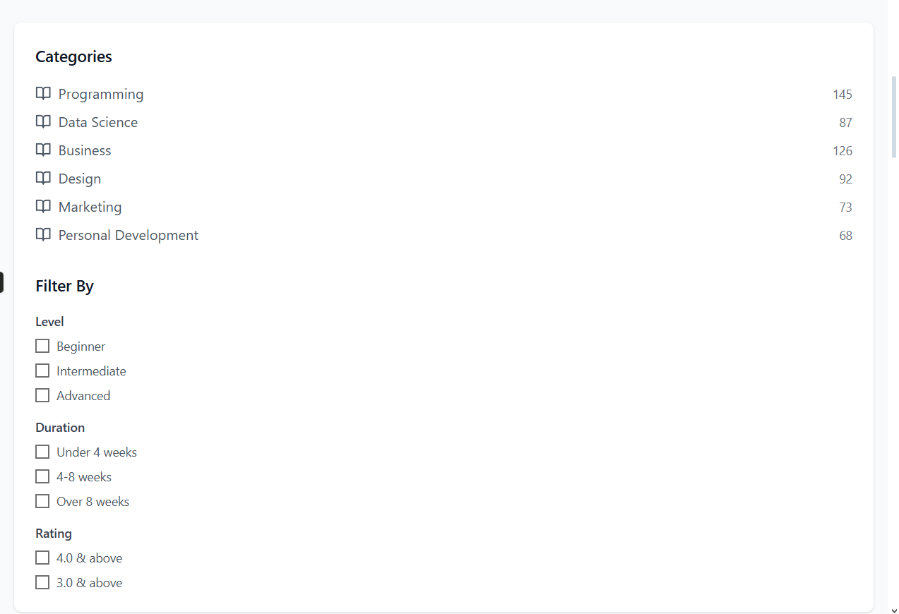

# LearnHub

**LearnHub** is a responsive and user-friendly course platform built with **React.js** and **Tailwind CSS**. The platform allows users to explore courses by category, view course details, add courses to a cart, and begin learning immediately.

---

## Features

- View and explore a list of available courses
- Add selected courses to the cart
- Start any added course directly from the interface
- Browse courses by categorized topics
- Responsive design with modern styling using Tailwind CSS

---

## Screenshots
 

---

## Tech Stack

- [React.js](https://reactjs.org/) – Frontend library
- [Tailwind CSS](https://tailwindcss.com/) – CSS utility framework
- [React Router](https://reactrouter.com/) – SPA routing

---
